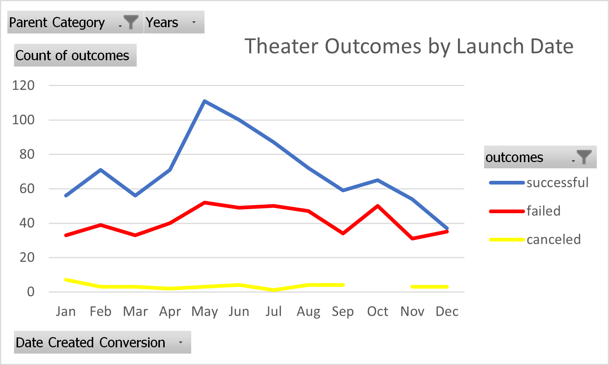
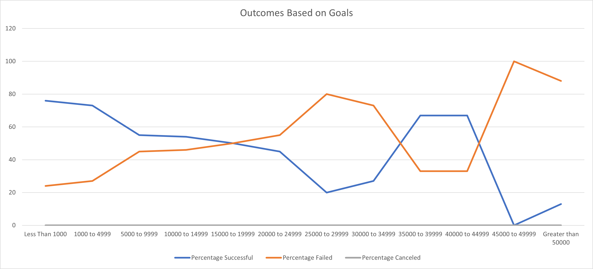

# An Analysis of Kickstarter Campaigns
Analyzing Kickstarter data to identify patterns and trends

## Overview of Project
* The purpose of this project is to help visualize various kickstarter data to gain a better understanding of when, how and where one can begin a kickstarter campaign to maximize success.

## Analysis and Challenges
  * The analysis was made by examining a large dataset of various types of kickstarter campaign data which included; the type of campaign, the goal and date of the campaign, how many backers, what country the campaign was launched in, etc.
  * The first part of the analysis turned out to be a challenge. After figuring out which campaigns were successful, I wanted to figure out why they were successful and if there were any trends I could easily see or isolate that correlated to its success.
  * The challenge that quickly arose, was that a lot of the data needed to be extrapolated so that clearer trends can be seen through the amount of money backers were willing to give, when they willing to give and to specifically what type (category) of campaign they gave to.

## Analysis of Outcomes Based on Launch Date
  * After gathering data into a pivot table and then into a chart I was able to identify a few trends.
  * Please refer to the chart below

  * The chart above gives some great insight into when campaigns were started and the amount of successful, failed and canceled campaigns. 
  * While looking at the data you can see definitively, that altogether, there are always more successes than failures with their campaigns and very few are canceled.
  * Approaching the summer time seems to yield the highest amount of successful campaigns in comparison to failures. The months May, June, July and August seem to have the biggest separation in their outcomes.
  
## Analysis of Outcomes Based on Goals
  * Please refer to this chart below
  * 
  * This chart refers to the percentage of success a campaign had in correspondence to it's goal.
  * With this chart it also displays some unpredictability after goals that needed for the $20,000. The percentage of success fluctuates at that point.  

## Results

* 2 conclusions that could be drawn from the Outcomes based on Launch Date are that the chart shows a trend that May has been the best time to start a campaign and has shown the greatest amount of successful campaigns versus failed (111 successes to 52 fails) while, December has shown that campaigns that launched at those times typically weren't successful. 

* As for the Outcome vs Goals there is one clear conclusion. Outside of 2 Outliers, with a goal between $35000 and $45000, there is a trend that the more money needed to reach the goal impacts the successfulness of the campaign. 

* This dataset is limited by not providing the data on how much each backer gave to each campaign. Without knowing that data there can be outliers that can skew conclusions. i.e. if a campaigns goal is "$10,000 and 1 backer gives $9,654 and 13 others give the remainder of the goal. The average donation is $715, when we can see clearly here that was not the case.
* This dataset is also limited by not being able to detail what type of methods were taken into pushing it's campaigns to its backers. We do not know whether there were endorsements, advertisements, pledge incentives, etc.

* There are many other possible tables and/or graphs that could be created. Here are 2 that can be quite helpful. Using the same data from the "Theater Outcomes vs Launch dates" another graph could show the distance/rate of change between successes and failures for each of the months. That data could be used to figure out the highest success rate based on the month.
* A chart that compares country successes and failures by category would also be useful to see which country to launch your campaign in or where to focus efforts for donations and pledging.
